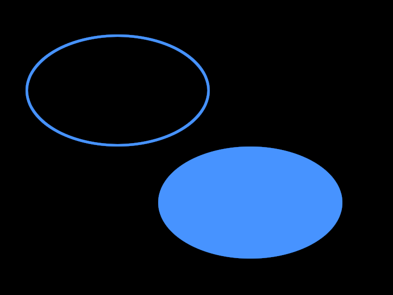

<i>This is an early release of the OTF capability. Please read [Issues and Considerations](otf_issues.md)!</i>

## Create primitive: Ellipse Outline
<b>VDU 23, 30, 50, id; pid; flags; x; y; w; h; color</b> : Create primitive: Ellipse Outline

This commmand creates a primitive that draws the outline of an ellipse. The ellipse is not filled. Note that width and height
are given, not the diagonal coordinates.

## Create primitive: Solid Ellipse
<b>VDU 23, 30, 51, id; pid; flags; x; y; w; h; color</b> : Create primitive: Solid Ellipse

This commmand creates a primitive that draws a solid, filled ellipse.
The ellipse does not have a distinct outline with a different
color than the fill color.
Note that width and height are given, not
the diagonal coordinates.

The following image illustrates the concepts, but the actual appearances will differ on the Agon, because this image was created on a PC.

[Home](otf_mode.md)
