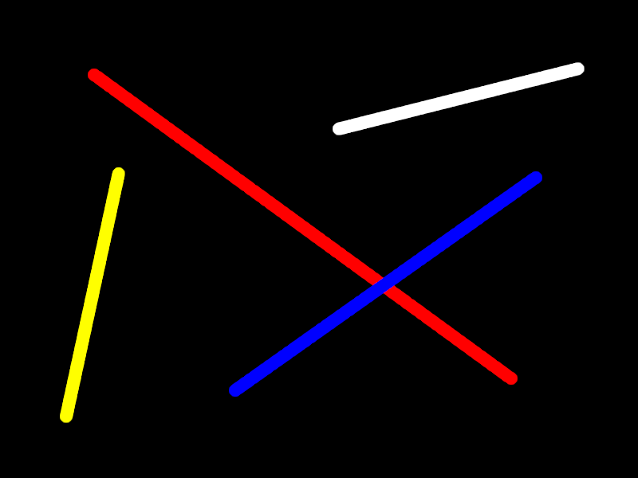

<i>This is an early release of the OTF capability. Please read [Issues and Considerations](otf_issues.md)!</i>

## Create primitive: Line
<b>VDU 23, 30, 20, id; pid; flags; x1; y1; x2; y2; color</b> :  Create primitive: Line

This commmand creates a primitive that draws a line. The endpoints
are included (i.e., are drawn).

The following image illustrates the concepts, but the actual appearances will differ on the Agon, because this image was created on a PC.

[Home](otf_mode.md)
