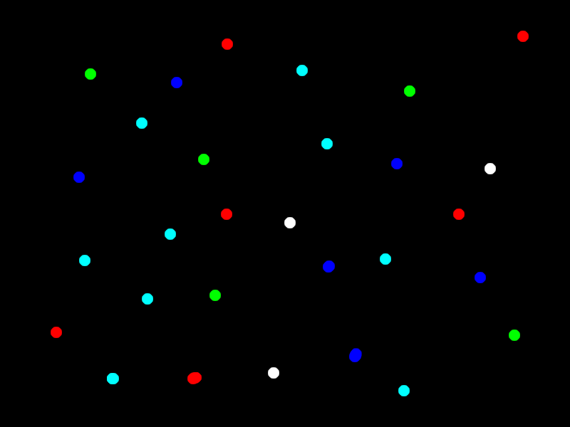

<i>This is an early release of the OTF capability. Please read [Issues and Considerations](otf_issues.md)!</i>

## Create primitive: Point
<b>VDU 23, 30, 10, id; pid; flags; x; y; color</b> :  Create primitive: Point

This command creates a primitive that draws a point (sets a single pixel).

The following image illustrates the concepts, but the actual appearances will differ on the Agon, because this image was created on a PC.

[Home](otf_mode.md)
