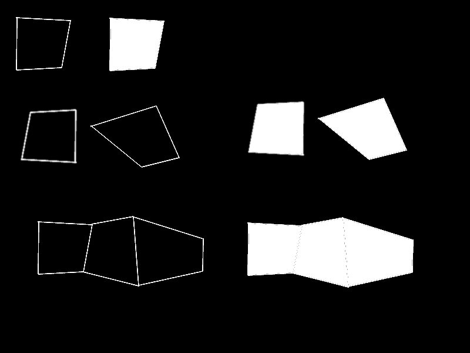

<i>This is an early release of the OTF capability. Please read [Issues and Considerations](otf_issues.md)!</i>

## Create primitive: Quad Outline
<b>VDU 23, 30, 60, id; pid; flags; color, x1; y1; x2; y2; x3; y3; x4; y4;</b> : Create primitive: Quad Outline

A quad is a 4-sided, convex polygon that does not necessarily have any internal right angles, but could.
The quad is not filled.

## Create primitive: Solid Quad
<b>VDU 23, 30, 61, id; pid; flags; color, x1; y1; x2; y2; x3; y3; x4; y4;</b> : Create primitive: Solid Quad

A quad is a 4-sided, convex polygon that does not necessarily have any internal right angles, but could.
The quad is filled, but does not have a distinct
edge color that differs from the given color.

## Create primitive: Quad List Outline
<b>VDU 23, 30, 62, id; pid; flags; n; color, x1; y1; ...</b> : Create primitive: Quad List Outline

A quad list is a series of quads that do not necessarily share points, but could, if those points are duplicated. They may be located together or apart. For each quad, its 4 points must be specified.

The "n" parameter is the number of quads, so the total number of points specified equals n*4.

## Create primitive: Solid Quad List
<b>VDU 23, 30, 63, id; pid; flags; n; color, x1; y1; ...</b> : Create primitive: Solid Quad List

A quad list is a series of quads that do not necessarily share points, but could, if those points are duplicated.
The quads are filled, but do not have a distinct
edge color that differs from the given color.

The "n" parameter is the number of quads, so the total number of points specified equals n*4.

## Create primitive: Quad Strip Outline
<b>VDU 23, 30, 64, id; pid; flags; n; color, sx0; sy0; sx1; sy1; x1; y1; ...</b> : Create primitive: Quad Strip Outline

A quad strip is a series of quads where each 2 consecutive quads share 2 common points. The quads are not filled.

The "n" parameter is the number of quads, so the total number of points specified equals n*2+2.

## Create primitive: Solid Quad Strip
<b>VDU 23, 30, 65, id; pid; flags; n; color, sx0; sy0; sx1; sy1; x1; y1; ...</b> : Create primitive: Solid Quad Strip

A quad strip is a series of quads where each 2 consecutive quads share 2 common points. The quads are filled, but do not have a distinct
edge color that differs from the given color.

The "n" parameter is the number of quads, so the total number of points specified equals n*2+2.

The following image illustrates the concepts, but the actual appearances will differ on the Agon, because this image was created on a PC.

[Home](otf_mode.md)
