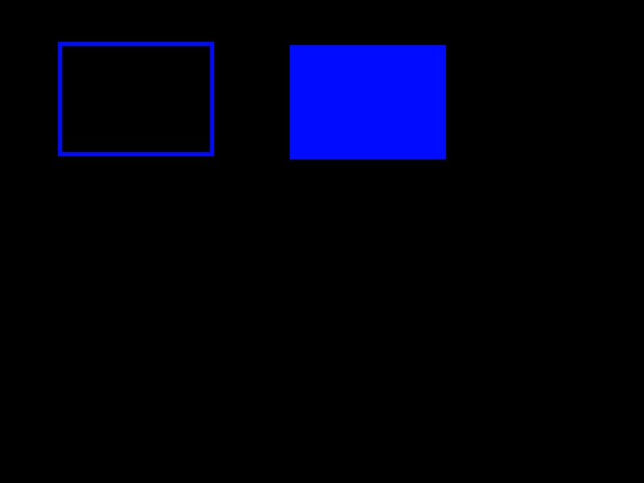

<i>This is an early release of the OTF capability. Please read [Issues and Considerations](otf_issues.md)!</i>

## Create primitive: Rectangle Outline
<b>VDU 23, 30, 40, id; pid; flags; x; y; w; h; color</b> : Create primitive: Rectangle Outline

This commmand creates a primitive that draws the outline of a rectangle. The rectangle is not filled. Note that the width and
height are given, not the diagonal coordinates.

## Create primitive: Solid Rectangle
<b>VDU 23, 30, 41, id; pid; flags; x; y; w; h; color</b> : Create primitive: Solid Rectangle

This commmand creates a primitive that draws a solid, filled rectangle.
The rectangle does not have a distinct outline with a different
color than the fill color.
Note that the width and height are given, not the diagonal coordinates.

OTF mode will automatically set the PRIM_FLAGS_ALL_SAME flag
when this command is used.

The following image illustrates the concepts, but the actual appearances will differ on the Agon, because this image was created on a PC.

[Home](otf_mode.md)
