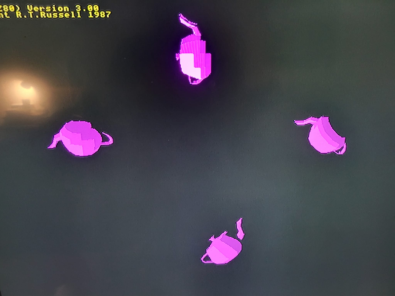

<i>This is an early release of the OTF capability. Please read [Issues and Considerations](otf_issues.md)!</i>

## Introduction to 3D Render Commands

A 3D scene is composed of one or more object models (meshes), each of which uses
some texture for colorizing the model. A texture uses a bitmap for its
pixel colors, and the model uses texture coordinates to assign colors to its
surfaces when the render is performed.

There are various mathematical computations involved in 3D rendering, of course,
and floating point numbers are used for many of those computations. However, VDU
commands do not directly support passing floating point numbers, as the VDU statement
only supports passing 1-byte and 2-byte values. For that reason, many of the
values passed to the render commands are scaled values.

The commands below use numbers with the following meaning and ranges:
<br><br><b>id</b>: A specific primitive ID in the range 0 to 65535, where 0 is the root primitve.
In this document, it refers to a render primitive, which is an enhanced bitmap primitive.
<br><br><b>pid</b>: A parent primitive ID in the range 0 to 65535, where 0 is the root primitve.
<br><br><b>mid</b>: A specific mesh ID in the range 0 to 65535. This is not a primitive ID.
<br><br><b>oid</b>: A specific object ID in the range 0 to 65535. This is not a primitive ID.
<br><br><b>flags</b>: Refer to the Primitive Flags section of this document.
<br><br><b>n</b>: A positive number (count) of things that follow within the same command.
<br><br><b>x</b>: A 2D X coordinate in the range -32768 to +32767. Often, the value is in or near the range of 0 to 800.
<br><br><b>y</b>: A 2D Y coordinate in the range -32768 to +32767. Often, the value is in or near the range of 0 to 600.
<br><br><b>w</b>: A positive width that typically ranges from 1 to 800.
<br><br><b>h</b>: A positive height that typically ranges from 1 to 600.
<br><br><b>x0, y0, z0</b>: A prescaled 3D X, Y, or Z coordinate in the range -32767 to +32767.
This number is divided by 32767 to yield a floating point number in the range -1.0 to +1.0, for 3D computations.
To prescale a set of coordinates for use in a VDU command, scale them all to fit within the range -1.0 to +1.0,
then multiply the original floating point values by 32767.
```
F = FACTOR * 32767
PX = X * F
PY = Y * F
PZ = Z * F
VDU ... PX; PY; PZ; ...
```
<br><br><b>i0</b>: A zero-based index into a list of coordinates (mesh or texture).
<br><br><b>u0, v0</b>: A texture coordinate ranging from 0 to the width or height of the texture.
This value is divided by the texture width or height to yield a floating point number, for 3D computations.
To prescale a set of coordinates for use in a VDU command, scale them all to fit within the range 0.0 to +1.0,
then multiply the original floating point values by the texture width or height, as appropriate.
```
PU = U * FACTOR * TEXWIDTH
PV = V * FACTOR * TEXHEIGHT
VDU ... PU; PV; ...
```
<br><br><b>scalex, scaley, scalez</b>: A prescaled 3D X, Y, or Z scale value in the range 0 to 65535.
This number is divided by 256 to yield a floating point number in the approximate range 0.0 to 256.0, for 3D computations.
To prescale a set of scale factors for use in a VDU command, multiply them by 256.
```
F = 256
PSX = SX * F
PSY = SY * F
PSZ = SZ * F
VDU ... PSX; PSY; PSZ; ...
```
<br><br><b>anglex, angley, anglez</b>: A prescaled 3D X, Y, or Z rotation angle value in the range -32767 to +32767.
This number is divided by 32767 to yield a floating point number in the range -1.0 to +1.0, for 3D computations.
The resulting number is multiplied by 2PI, to yield an angle in radians.
Thus, the passed value of -32767 means -2PI, and +32767 means +2PI.
To prescale a set of angles in radians for use in a VDU command, divide the angles by 2PI, which will
scale them all to fit within the range -1.0 to +1.0,
then multiply the original floating point values by 32767.
```
F = 32767 / TWOPI
PAX = AX * F
PAY = AY * F
PAZ = AZ * F
VDU ... PAX; PAY; PAZ; ...
```
<br><br><b>distx, disty, distz</b>: A prescaled 3D X, Y, or Z translation distance in the range -32767 to +32767.
This number is divided by 32767 to yield a floating point number in the range -1.0 to +1.0, for 3D computations.
The resulting number is multiplied by 256.0.
Thus, the passed value of -32767 means -256.0, and +32767 means +256.0.
To prescale a set of distances for use in a VDU command, divide the distances by 256,
scale them all to fit within the range -1.0 to +1.0,
then multiply the original floating point values by 32767.
```
F = 256
PDX = DX * F
PDY = DY * F
PDZ = DZ * F
VDU ... PDX; PDY; PDZ; ...
```
<br>

## Create primitive: Solid Render
<b>VDU 23, 30, 200, id; pid; flags; x; y; w; h; psram</b> :  Create primitive: Solid Render

This command creates a primitive that renders a 3D scene to a bitmap. The bitmap can be
manipulated or altered using the bitmap primitive commands, after the scene image
has been rendered. A scene may contain multiple objects. This render primitive must be
created prior to using other 3D related commands, below.

A solid render has pixels that are all 100% opaque (0% transparent).

If the psram parameter is nonzero, the bitmap pixels are kept in PSRAM (SPI RAM)
rather than in DRAM. This should only be done in resolutions where the pixel clock
rate is relatively slow; otherwise, flicker may occur.

## Create primitive: Masked Render
<b>VDU 23, 30, 201, id; pid; flags; x; y; w; h; psram, color</b> :  Create primitive: Masked Render

This command creates a primitive that renders a 3D scene to a bitmap. The bitmap can be
manipulated or altered using the bitmap primitive commands, after the scene image
has been rendered. A scene may contain multiple objects. This render primitive must be
created prior to using other 3D related commands, below.

A masked render has pixels that are all either 100% opaque (0% transparent) or
0% opaque (100% transparent). The given color is used as the transparency color,
and should be a color (including its alpha bits) that is not likely to appear in
the rendered image. For example, if the image will have no dark red pixels that are 25%
opaque, then the color could be specified as 1 or &01 in BASIC (0x01 in C).

If the psram parameter is nonzero, the bitmap pixels are kept in PSRAM (SPI RAM)
rather than in DRAM. This should only be done in resolutions where the pixel clock
rate is relatively slow; otherwise, flicker may occur.

## Create primitive: Transparent Render
<b>VDU 23, 30, 202, id; pid; flags; x; y; w; h; psram, color</b> :  Create primitive: Transparent Render

This command creates a primitive that renders a 3D scene to a bitmap. The bitmap can be
manipulated or altered using the bitmap primitive commands, after the scene image
has been rendered. A scene may contain multiple objects. This render primitive must be
created prior to using other 3D related commands, below.

A transparent render has pixels that are 100% opaque (0% transparent), 75% opaque
(25% transparent), 50% opaque (50% transparent), 25% opaque (75% transparent), or
0% opaque (100% transparent). The given color is used as the transparency color,
and should be a color (including its alpha bits) that is not likely to appear in
the rendered image. For example, if the image will have no dark red pixels that are 25%
opaque, then the color could be specified as 1 or &01 in BASIC (0x01 in C).

If the psram parameter is nonzero, the bitmap pixels are kept in PSRAM (SPI RAM)
rather than in DRAM. This should only be done in resolutions where the pixel clock
rate is relatively slow; otherwise, flicker may occur.

## Define Mesh Vertices
<b>VDU 23, 30, 203, id; mid; n; x0; y0; z0; ...</b> :  Define Mesh Vertices

This command establishes the list of mesh coordinates to be used to define
a surface structure. The mesh may be referenced by multiple objects.

The "n" parameter is the number of vertices, so the total number of coordinates specified equals n*3.

## Set Mesh Vertex Indices
<b>VDU 23, 30, 204, id; mid; n; i0; ...</b> :  Set Mesh Vertex Indices

This command lists the indexes of the vertices that define a 3D mesh. Individual
vertices are often referenced multiple times within a mesh, because they are
often part of multiple surface triangles. Each index value ranges from 0 to
the number of defined mesh vertices.

The "n" parameter is the number of indices.

## Define Texture Coordinates
<b>VDU 23, 30, 205, id; mid; n; u0; v0; ...</b> :  Define Texture Coordinates

This command establishes the list of U/V texture coordinates that define texturing
for a mesh.

The "n" parameter is the number of coordinate pairs, so the total number of coordinates specified equals n*2.

## Set Texture Coordinate Indices
<b>VDU 23, 30, 206, id; mid; n; i0; ...</b> :  Set Texture Coordinate Indices

This command lists the indexes of the coordinates that define a 3D texture for a mesh.
Individual coordinates may be referenced multiple times within a texture,
but that is not required. The number of indices passed in this command must match
the number of mesh indices defining the mesh. Thus, each mesh vertex has texture
coordinates associated with it.

The "n" parameter is the number of indices.

## Define Object
<b>VDU 23, 30, 207, id; oid; mid; bmid;</b> :  Create Object

This command defines a renderable object in terms of its already-defined mesh,
plus a reference to an existing bitmap that provides its coloring, via the
texture coordinates used by the mesh. The same mesh can be used multiple times,
with the same or different bitmaps for coloring.

## Set Object X Scale Factor
<b>VDU 23, 30, 208, id; oid; scalex;</b> :  Set Object X Scale Factor

This command sets the X scale factor for an object.

## Set Object Y Scale Factor
<b>VDU 23, 30, 209, id; oid; scaley;</b> :  Set Object Y Scale Factor

This command sets the Y scale factor for an object.

## Set Object Z Scale Factor
<b>VDU 23, 30, 210, id; oid; scalez;</b> :  Set Object Z Scale Factor

This command sets the Z scale factor for an object.

## Set Object XYZ Scale Factors
<b>VDU 23, 30, 211, id; oid; scalex; scaley; scalez</b> :  Set Object XYZ Scale Factors

This command sets the X, Y, and Z scale factors for an object.

## Set Object X Rotation Angle
<b>VDU 23, 30, 212, id; oid; anglex;</b> :  Set Object X Rotation Angle

This command sets the X rotation angle for an object.

## Set Object Y Rotation Angle
<b>VDU 23, 30, 213, id; oid; angley;</b> :  Set Object Y Rotation Angle

This command sets the Y rotation angle for an object.

## Set Object Z Rotation Angle
<b>VDU 23, 30, 214, id; oid; anglez;</b> :  Set Object Z Rotation Angle

This command sets the Z rotation angle for an object.

## Set Object XYZ Rotation Angles
<b>VDU 23, 30, 215, id; oid; anglex; angley; anglez;</b> :  Set Object XYZ Rotation Angles

This command sets the X, Y, and Z rotation angles for an object.

## Set Object X Translation Distance
<b>VDU 23, 30, 216, id; oid; distx;</b> :  Set Object X Translation Distance

This command sets the X translation distance for an object.
Note that 3D translation of an object is independent of 2D translation of the bitmap
belonging to the render primitive.

## Set Object Y Translation Distance
<b>VDU 23, 30, 217, id; oid; disty;</b> :  Set Object Y Translation Distance

This command sets the Y translation distance for an object.
Note that 3D translation of an object is independent of 2D translation of the bitmap
belonging to the render primitive.

## Set Object Z Translation Distance
<b>VDU 23, 30, 218, id; oid; distz;</b> :  Set Object Z Translation Distance

This command sets the Z translation distance for an object.
Note that 3D translation of an object is independent of 2D translation of the bitmap
belonging to the render primitive.

## Set Object XYZ Translation Distances
<b>VDU 23, 30, 219, id; oid; distx; disty; distz</b> :  Set Object XYZ Translation Distances

This command sets the X, Y, and Z translation distances for an object.
Note that 3D translation of an object is independent of 2D translation of the bitmap
belonging to the render primitive.

## Render To Bitmap
<b>VDU 23, 30, 220, id;</b> :  Render To Bitmap

This command uses information provided by the above commands to render the 3D scene
onto the bitmap belonging to the render primitive. This command must be used in
order to perform the render operation; it does <i>not</i> happen automatically, when other
commands change some of the render parameters.

The following image illustrates the concept.




[Bitmap](otf_bitmap.md)
[Home](otf_mode.md)
