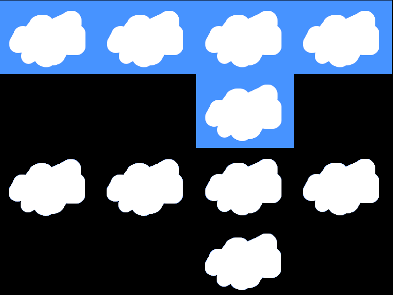

<i>This is an early release of the OTF capability. Please read [Issues and Considerations](otf_issues.md)!</i>

## Create primitive: Tile Array
<b>VDU 23, 30, 80, id; pid; flags; columns; rows; tw; th; w; h;</b> : Create primitive: Tile Array

This commmand creates a primitive that draws a full or mostly full tile array, as opposed to a sparse tile map.
The number of cells in the array is equal to the number of rows
multiplied by the number of columns. The given tile width and tile height
specify the size of a single tile. The overall width and height of the tile
array are specified separately.

The given width must be a multiple of 4 pixels. The given height can be any positive number, bearing in mind the memory requirements for
storing bitmaps.

The tile array will store its own setup of bitmaps, which are distinct
from any bitmaps created as individual primitives. If the
tile array is deleted, its owned bitmaps are deleted with it.

A tile array is intended to be used when the ratio of defined
(used) cells to undefined (unused) cells is rather high. Since it
is implemented as an array, processing it is faster than using a
tile map. The trade-off is that the entire array is allocated
from RAM, so it may be more expensive than a sparse tile map.
Thus, if you want a set of tiles with a low used-to-unused ratio,
consider using a tile map, to avoid wasting space for unused cells.

Even though a tile array is fully allocated, each cell is just a pointer
to the pixel data for some tile bitmap (such bitmaps can be shared), and that pointer can be NULL,
in which case, nothing is drawn for the corresponding cell. In that
manner, you can create an array that appears to be sparse. Such is
the case with random-length text lines in the text area primitive,
which is a tile array.

## Create Solid Bitmap for Tile Array
<b>VDU 23, 30, 81, id; pid; flags; w; h;</b> : Create Solid Bitmap for Tile Array

This commmand creates a solid bitmap to be used within a tile array.
Every pixel is fully opaque (though each pixel has its own color).
A solid bitmap may be the most efficient kind of bitmap, from a
processing speed perspective. Bitmaps with any transparency may be slower, and their overuse could cause flicker.

OTF mode will automatically set the PRIM_FLAGS_ALL_SAME flag
when this command is used.

If you create a text area primitive, which is a tile array, and
use the Define Text Area Character or Define Text Area Character
Range command, then the required solid bitmap(s) is(are)
created automatically.

## Create Masked Bitmap for Tile Array
<b>VDU 23, 30, 82, id; pid; flags; w; h; color</b> : Create Masked Bitmap for Tile Array

<i>This command code is reserved for potential future use.
The command is not presently implemented.</i>

This commmand creates a masked bitmap to be used within a tile array.
Every pixel is either fully opaque (though each pixel has its own color) or fully transparent.
A solid bitmap may be the most efficient kind of bitmap, from a
processing speed perspective. Bitmaps with any transparency may be slower, and their overuse could cause flicker.

The given color is used to represent fully transparent pixels,
so be sure to specify a byte value that is unique from any
visible color in the source bitmap. When setting the color of
each pixel in the bitmap, use that given color for any pixels
that must be invisible.

## Create Transparent Bitmap for Tile Array
<b>VDU 23, 30, 83, id; pid; flags; w; h; color</b> : Create Transparent Bitmap for Tile Array

<i>This command code is reserved for potential future use.
The command is not presently implemented.</i>

This commmand creates a transparent bitmap to be used within a tile array.
Each pixel has either 0%, 25%, 50%, 75%, or 100% opacity.
A transparent bitmap may be the least efficient kind of bitmap, from a
processing speed perspective. Bitmaps with any transparency may be slower than solid bitmaps, and their overuse could cause flicker.

The given color is used to represent fully transparent pixels,
so be sure to specify a byte value that is unique from any
visible color in the source bitmap. When setting the color of
each pixel in the bitmap, use that given color for any pixels
that must be invisible.

OTF mode will automatically set the PRIM_FLAGS_BLENDED flag
when this command is used.

## Set bitmap ID for tile in tile array
<b>VDU 23, 30, 84, id; column; row; bmid;</b> : Set bitmap ID for tile in Tile Array

This command specifies which bitmap should be draw in a specific
cell of a tile array. The bitmap must have been created already.
Passing a zero for the bitmap ID will prevent the cell from
being drawn, so it will appear as an empty cell.

## Set solid bitmap pixel in tile array
<b>VDU 23, 30, 85, id; bmid; x; y; color</b> : Set solid bitmap pixel in Tile Array

This command sets the color of a single pixel within a solid
bitmap that belongs to a tile array.

## Set masked bitmap pixel in tile array
<b>VDU 23, 30, 86, id; bmid; x; y; color</b> : Set masked bitmap pixel in Tile Array

This command sets the color of a single pixel within a masked
bitmap that belongs to a tile array.
To specify a fully transparent pixel, use the same color that
was used to create the tile bitmap.

## Set transparent bitmap pixel in tile array
<b>VDU 23, 30, 87, id; bmid; x; y; color</b> : Set transparent bitmap pixel in Tile Array

This command sets the color of a single pixel within a transparent
bitmap that belongs to a tile array.
To specify a fully transparent pixel, use the same color that
was used to create the tile bitmap.

## Set solid bitmap pixels in tile array
<b>VDU 23, 30, 88, id; bmid; x; y; n; c0, c1, c2, ...</b> : Set solid bitmap pixels in Tile Array

This command sets the colors of multiple pixels within a tile array.
As colors are processed, if the end of a scan line in the
bitmap is reached, processing moves to the first pixel in
the next scan line. Thus, it is possible to provide colors
for every pixel in the bitmap, using a single command.

The "n" parameter is the number of pixels.

## Set masked bitmap pixels in tile array
<b>VDU 23, 30, 89, id; bmid; x; y; n; c0, c1, c2, ...</b> : Set masked bitmap pixels in Tile Array

This command sets the colors of multiple pixels within a tile array.
As colors are processed, if the end of a scan line in the
bitmap is reached, processing moves to the first pixel in
the next scan line. Thus, it is possible to provide colors
for every pixel in the bitmap, using a single command.
To specify a fully transparent pixel, use the same color that
was used to create the bitmap.

The "n" parameter is the number of pixels.

## Set transparent bitmap pixels in tile array
<b>VDU 23, 30, 90, id; bmid; x; y; n; c0, c1, c2, ...</b> : Set transparent bitmap pixels in Tile Array

This command sets the colors of multiple pixels within a tile array.
As colors are processed, if the end of a scan line in the
bitmap is reached, processing moves to the first pixel in
the next scan line. Thus, it is possible to provide colors
for every pixel in the bitmap, using a single command.
To specify a fully transparent pixel, use the same color that
was used to create the bitmap.

The "n" parameter is the number of pixels.

The following image illustrates the concepts, but the actual appearances will differ on the Agon, because this image was created on a PC.

[Home](otf_mode.md)
