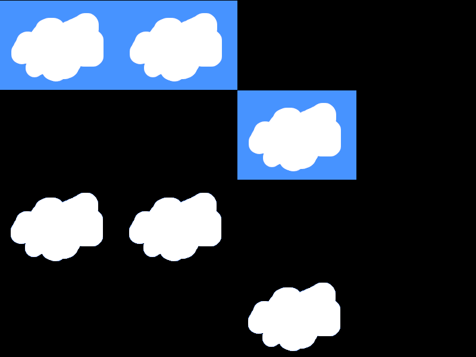

<i>This is an early release of the OTF capability. Please read [Issues and Considerations](otf_issues.md)!</i>

## Create primitive: Tile Map
<b>VDU 23, 30, 100, id; pid; flags; columns; rows; tw; th; w; h;</b> : Create primitive: Tile Map

This commmand creates a primitive that draws a sparse tile map,
as opposed to a full or mostly full tile array.
The number of cells in the map is equal to the number of rows
multiplied by the number of columns. The given tile width and tile height
specify the size of a single tile. The overall width and height of the tile
map are specified separately.

The given width must be a multiple of 4 pixels. The given height can be any positive number, bearing in mind the memory requirements for
storing bitmaps.

The tile map will store its own setup of bitmaps, which are distinct
from any bitmaps created as individual primitives. If the
tile map is deleted, its owned bitmaps are deleted with it.

A sparse tile map is intended to be used when the ratio of defined
(used) cells to undefined (unused) cells is rather low. Since it
is implemented as a map, processing it is slower than using a
tile array. Thus, if you want a set of tiles with a high used-to-unused ratio,
it would be more efficient to use a tile array. Slower processing
might cause flicker.

Refer to the section on OTF Primitive Flags for information about
certain flags that are useful for tile maps.

## Create Solid Bitmap for Tile Map
<b>VDU 23, 30, 101, id; bmid;</b> : Create Solid Bitmap for Tile Map

This commmand creates a solid bitmap to be used within a tile map.
Every pixel is fully opaque (though each pixel has its own color).
A solid bitmap may be the most efficient kind of bitmap, from a
processing speed perspective. Bitmaps with any transparency may be slower, and their overuse could cause flicker.

OTF mode will automatically set the PRIM_FLAGS_ALL_SAME flag
when this command is used.

## Create Masked Bitmap for Tile Map
<b>VDU 23, 30, 102, id; bmid; color</b> : Create Masked Bitmap for Tile Map

This commmand creates a masked bitmap to be used within a tile map.
Every pixel is either fully opaque (though each pixel has its own color) or fully transparent.
A solid bitmap may be the most efficient kind of bitmap, from a
processing speed perspective. Bitmaps with any transparency may be slower, and their overuse could cause flicker.

The given color is used to represent fully transparent pixels,
so be sure to specify a byte value that is unique from any
visible color in the source bitmap. When setting the color of
each pixel in the bitmap, use that given color for any pixels
that must be invisible.

## Create Transparent Bitmap for Tile Map
<b>VDU 23, 30, 103, id; bmid; color</b> : Create Transparent Bitmap for Tile Map

This commmand creates a transparent bitmap to be used within a tile map.
Each pixel has either 0%, 25%, 50%, 75%, or 100% opacity.
A transparent bitmap may be the least efficient kind of bitmap, from a
processing speed perspective. Bitmaps with any transparency may be slower than solid bitmaps, and their overuse could cause flicker.

The given color is used to represent fully transparent pixels,
so be sure to specify a byte value that is unique from any
visible color in the source bitmap. When setting the color of
each pixel in the bitmap, use that given color for any pixels
that must be invisible.

OTF mode will automatically set the PRIM_FLAGS_BLENDED flag
when this command is used.

## Set bitmap ID for tile in tile map
<b>VDU 23, 30, 104, id; col; row; bmid;</b> : Set bitmap ID for tile in Tile Map

This command specifies which bitmap should be draw in a specific
cell of a tile map. The bitmap must have been created already.
Passing a zero for the bitmap ID will prevent the cell from
being drawn, so it will appear as an empty cell.

## Set solid bitmap pixel in tile map
<b>VDU 23, 30, 105, id; bmid; x; y; color</b> : Set solid bitmap pixel in Tile Map

This command sets the color of a single pixel within a solid
bitmap that belongs to a tile map.

## Set masked bitmap pixel in tile map
<b>VDU 23, 30, 106, id; bmid; x; y; color</b> : Set masked bitmap pixel in Tile Map

This command sets the color of a single pixel within a masked
bitmap that belongs to a tile map.
To specify a fully transparent pixel, use the same color that
was used to create the tile bitmap.

## Set transparent bitmap pixel in tile map
<b>VDU 23, 30, 107, id; bmid; x; y; color</b> : Set transparent bitmap pixel in Tile Map

This command sets the color of a single pixel within a transparent
bitmap that belongs to a tile map.
To specify a fully transparent pixel, use the same color that
was used to create the tile bitmap.

## Set solid bitmap pixels in tile map
<b>VDU 23, 30, 108, id; bmid; x; y; n; c0, c1, c2, ...</b> : Set solid bitmap pixels in Tile Map

This command sets the colors of multiple pixels within a tile map.
As colors are processed, if the end of a scan line in the
bitmap is reached, processing moves to the first pixel in
the next scan line. Thus, it is possible to provide colors
for every pixel in the bitmap, using a single command.

The "n" parameter is the number of pixels.

## Set masked bitmap pixels in tile map
<b>VDU 23, 30, 109, id; bmid; x; y; n; c0, c1, c2, ...</b> : Set masked bitmap pixels in Tile Map

This command sets the colors of multiple pixels within a tile map.
As colors are processed, if the end of a scan line in the
bitmap is reached, processing moves to the first pixel in
the next scan line. Thus, it is possible to provide colors
for every pixel in the bitmap, using a single command.
To specify a fully transparent pixel, use the same color that
was used to create the bitmap.

The "n" parameter is the number of pixels.

## Set transparent bitmap pixels in tile map
<b>VDU 23, 30, 110, id; bmid; x; y; n; c0, c1, c2, ...</b> : Set transparent bitmap pixels in Tile Map

This command sets the colors of multiple pixels within a tile map.
As colors are processed, if the end of a scan line in the
bitmap is reached, processing moves to the first pixel in
the next scan line. Thus, it is possible to provide colors
for every pixel in the bitmap, using a single command.
To specify a fully transparent pixel, use the same color that
was used to create the bitmap.

The "n" parameter is the number of pixels.

The following image illustrates the concepts, but the actual appearances will differ on the Agon, because this image was created on a PC.

[Home](otf_mode.md)
