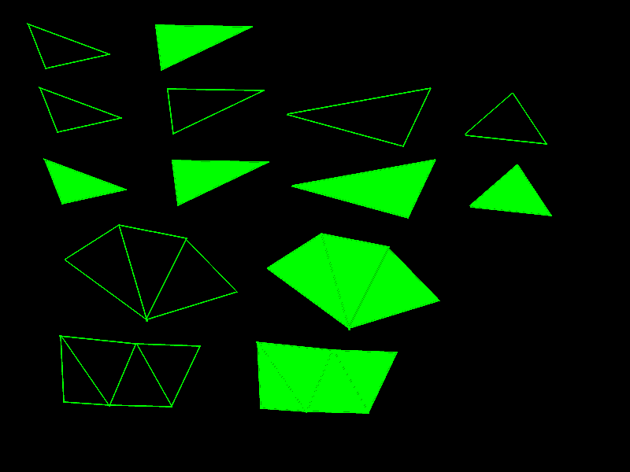

<i>This is an early release of the OTF capability. Please read [Issues and Considerations](otf_issues.md)!</i>

## Create primitive: Triangle Outline
<b>VDU 23, 30, 30, id; pid; flags; color, x1; y1; x2; y2; x3; y3;</b> : Create primitive: Triangle Outline

This commmand creates a primitive that draws the outline of a triangle. The triangle is not filled.

## Create primitive: Solid Triangle
<b>VDU 23, 30, 31, id; pid; flags; color, x1; y1; x2; y2; x3; y3;</b> : Create primitive: Solid Triangle

This commmand creates a primitive that draws a solid, filled
traingle. The triangle does not have a distinct outline with
a different color than the fill color.

## Create primitive: Triangle List Outline
<b>VDU 23, 30, 32, id; pid; flags; n; color, x1; y1; ...</b> : Create primitive: Triangle List Outline

This command creates a series of separate triangle outlines.

A triangle list is a series of triangles that do not necessarily share points, but could, if those points are duplicated. They may be located together or apart. For each triangle, its 3 points must be specified. The triangles are not filled.

The "n" parameter is the number of triangles, so the total number of points specified equals n*3.

## Create primitive: Solid Triangle List
<b>VDU 23, 30, 33, id; pid; flags; n; color, x1; y1; ...</b> : Create primitive: Solid Triangle List

A triangle list is a series of triangles that do not necessarily share points, but could, if those points are duplicated. They may be located together or apart. For each triangle, its 3 points must be specified. The triangles are filled, but do not have a distinct
edge color that differs from the given color.

The "n" parameter is the number of triangles, so the total number of points specified equals n*3.

## Create primitive: Triangle Fan Outline
<b>VDU 23, 30, 34, id; pid; flags; n; color, sx0; sy0; sx1; sy1; x1; y1; ...</b> : Create primitive: Triangle Fan Outline

A triangle fan is a series of triangles that share a common center point, and each 2 consecutive triangles share an edge point.
The triangles are not filled.

The "n" parameter is the number of triangles, so the total number of points specified equals n+2.

## Create primitive: Solid Triangle Fan
<b>VDU 23, 30, 35, id; pid; flags; n; color, sx0; sy0; sx1; sy1; x1; y1; ...</b> : Create primitive: Solid Triangle Fan

A triangle fan is a series of triangles that share a common center point, and each 2 consecutive triangles share an edge point.
The triangles are filled, but do not have a distinct
edge color that differs from the given color.

The "n" parameter is the number of triangles, so the total number of points specified equals n+2.

## Create primitive: Triangle Strip Outline
<b>VDU 23, 30, 36, id; pid; flags; n; color, sx0; sy0; sx1; sy1; x1; y1; ...</b> : Create primitive: Triangle Strip Outline

A triangle strip is a series of triangles where each 2 consecutive triangles share 2 common points. The triangles are not filled.

The "n" parameter is the number of triangles, so the total number of points specified equals n+2.

## Create primitive: Solid Triangle Strip
<b>VDU 23, 30, 37, id; pid; flags; n; color, sx0; sy0; sx1; sy1; x1; y1; ...</b> : Create primitive: Solid Triangle Strip

A triangle strip is a series of triangles where each 2 consecutive triangles share 2 common points. The triangles filled, but do not have a distinct
edge color that differs from the given color.

The "n" parameter is the number of triangles, so the total number of points specified equals n+2.

The following image illustrates the concepts, but the actual appearances will differ on the Agon, because this image was created on a PC.

[Home](otf_mode.md)
